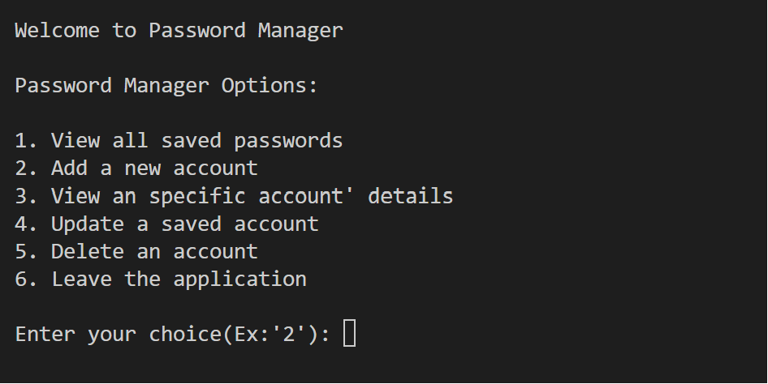
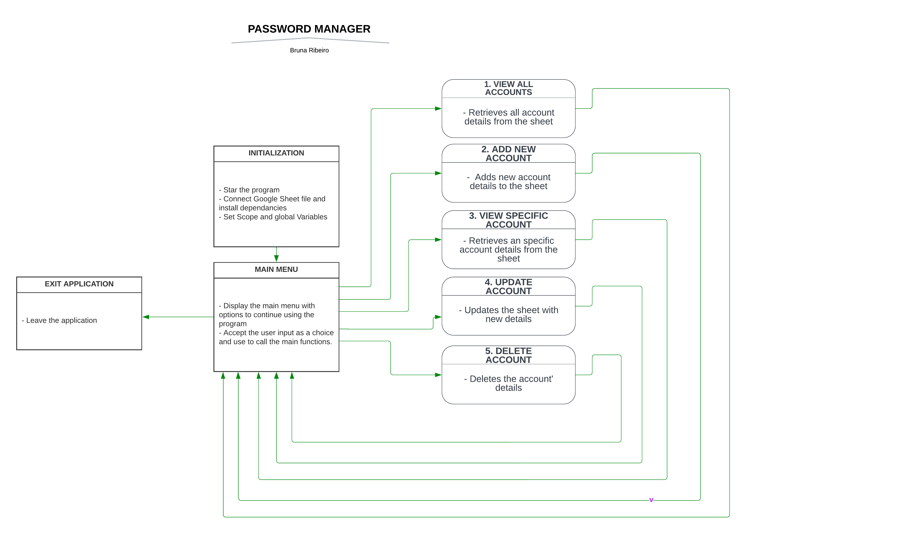
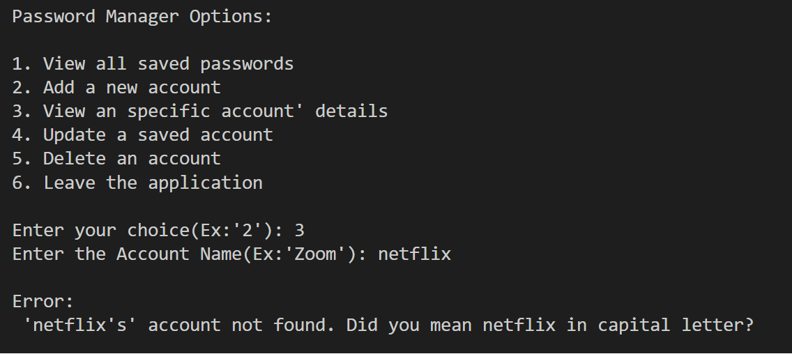
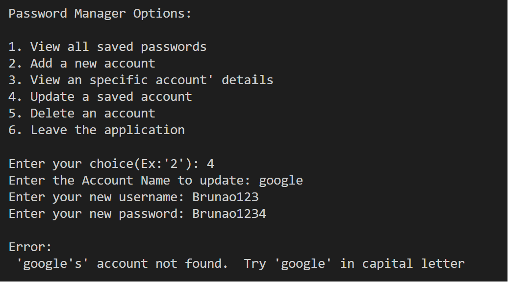

# Password Manager



Password Manager is a command line based program created with Python.

It provides a way to see, save, update and retrieve multiple login details.

The details are saved in a Google Sheet file, which is connected to the application with an API.

Many of of have swapped between main password managers providers, and have found issues when transfering data to a new password manager.

This program stores all kinds of login details, any type account and any type of passwords.

## Features

- __Main Menu__

  - The main menu greets the user and presents options to continue to use the program.

  

- __Option 1: View all saved accounts__

  - This feature lets the user retrieve all the stored accounts from the Google Sheet file.

  
  
- __Option 2: Add new account__

  - The funtion works as expected

  

  - Wrong input handling:

  

- __Option 3: View specific account__

  - The funtion works as expected

  

  - Wrong input handling:

  
  
- __Option 4: Update account__

  - The funtion works as expected

  

  - Wrong input handling:

  

- __Option 5: Delete an account__

  - The funtion works as expected

  

  - Wrong input handling:

  

- __Option 6: Exit Application__

  - The funtion works as expected

  

## Libraries 

- Gspred.
- Google-Auth(Credentials class only).

## Deployment

- The application was deployed to Heroku, steps are as follows:
  - Prepare requirements.txt file using pip freeze > requires.txt.
  - Create a new app in Heroku.
  - Change the settings:
    - Add sensitive information to Config Vars.
    - Add necessary BuildPacks.
  - Go to deploy and connect to Github account.
  - Select deployment (Automatic or Manual) We used Automatic for this project.

The live deployed project can be found here - 

## Creation process



## Content

- The content was created by Bruna Ribeiro, myself.
- The Login details are fictitious.
- The code not teached in Code instutite that was used in this project was taken and learned from [StackOverflow](https://stackoverflow.com).
- Flow-chart was made with [Lucid App](https://www.lucidchart.com)

## Testing

See below for how the program responds to incorrect or empty inputs:

- __Option 1: View all saved accounts__

  - No inputs are needed, however if no accounts are yet saved, the program will print an error as per code below:
  ```print("\nError: No accounts found.")```
  - Program will return to the main menu where you have the option to add a new account.
  
- __Option 2: Add new account__

  - No inputs are needed, but if the program is unable to add a new account, the program will print an error as per code below:
  ```print("\nError: Unable to add account. Please try again.")```
  - Program will return to the main menu where you have the option to try to add a new account again.

- __Option 3: View specific account__

  - Wrong input handling:

  
  
- __Option 4: Update account__

  - Wrong input handling:

  

- __Option 5: Delete an account__

  - Wrong input handling:

  


## Validator Testing and Other Tests

- [CI Python Linter](https://pep8ci.herokuapp.com/) - NO ERRORS FOUND
  

- [Python 3 Style Checker for beginners](https://www.codewof.co.nz/style/python3/) - NO ERRORS FOUND
  -This style checker will check your code against the main conventions recommended for Python in PEP 8 (Style Guide for Python Code) and PEP 257 (Docstring Conventions). Fine tuning your code to pass these common conventions makes it easy for others to read your Python code.


## Fixed bugs

- The gspread' update() method was the first option. However it genereated the error:

``` UserWarning: [Deprecated][in version 6.0.0]: method signature will change to: 'Worksheet.update(value = [[]], range_name=)' arguments 'range_name' and 'values' will swap, values will be mandatory of type: 'list(list(...))'  warnings.warn( ```

  - I seached for a solution both online and with Code Institute Tutors, they advised to look for an alternative code as there is an issue with the method signature from certain versions of the gspread library.
As an alternative, the account to be Updated is first deleted and then added with the newest data.

## Unfixed bugs

- If you request to see an Specific account that was added twice, it only returns the first found row in the sheet.

## Features to add in the future

- New password generator.
- Import Colorama for a better view and usage.