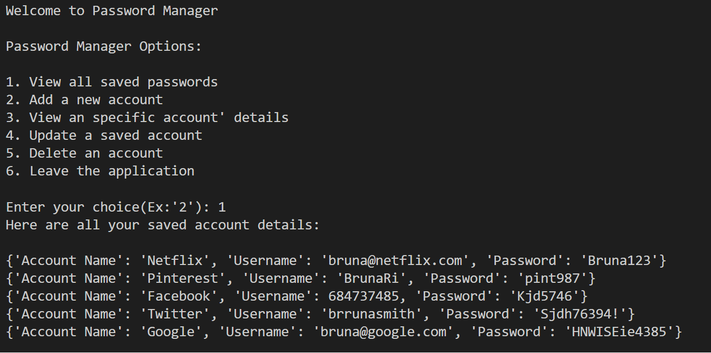
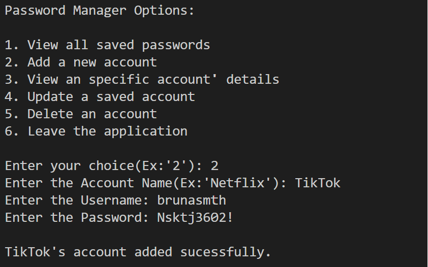
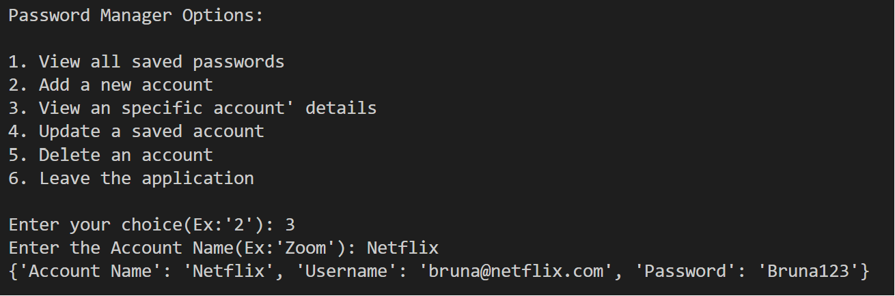
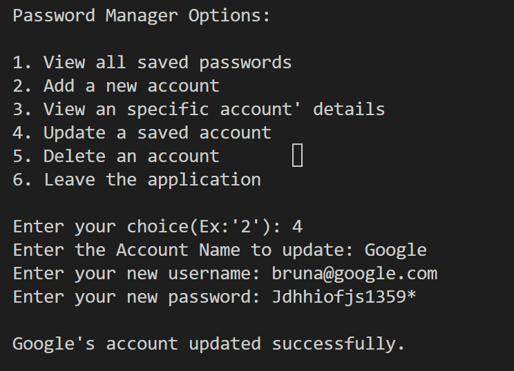
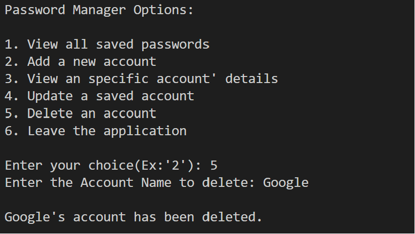
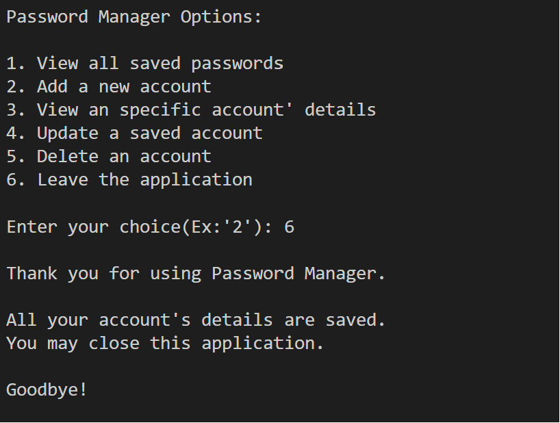
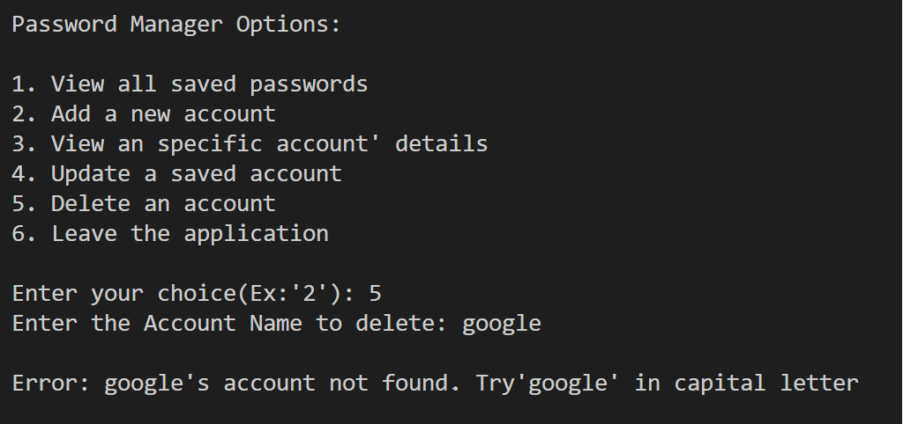
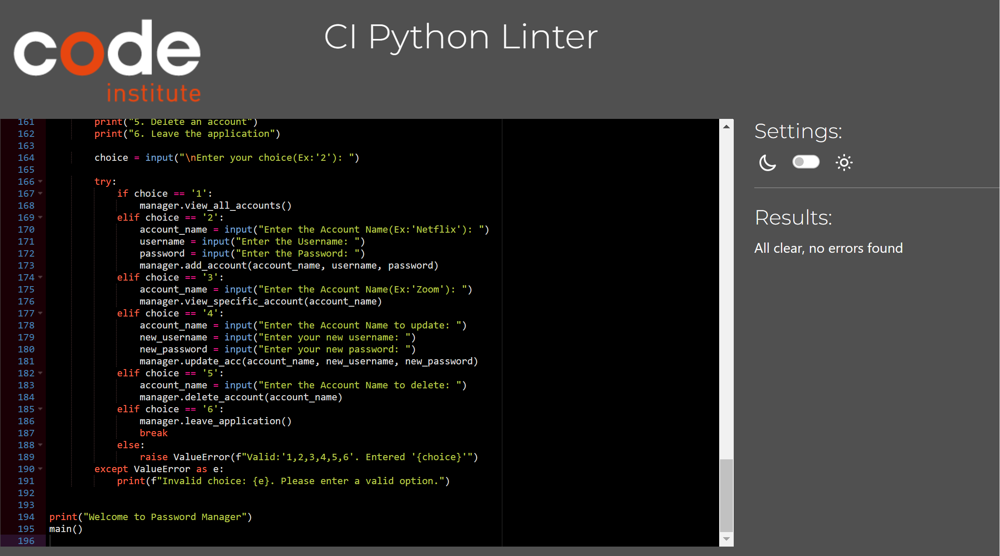
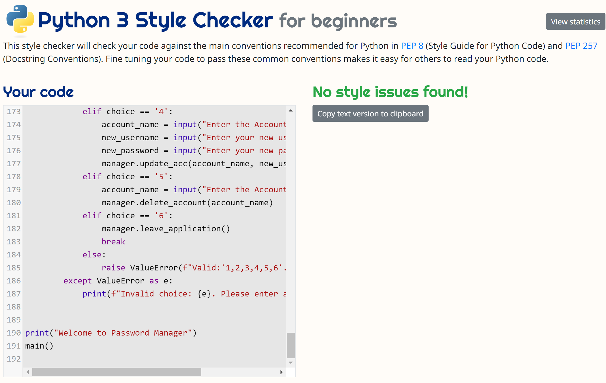

# Password Manager


Password Manager is a Object-Oriented, command line based program created with Python.

It provides a way to see, save, update and retrieve multiple login details.

The details are saved in a Google Sheets file, which is connected to the application with an API.

Many of us have swapped between main password managers' providers, or brand devices and sadly had issues when transfering data to a new password manager. This application is valuable to the user as it stores all kinds of login details, any type account and any type of passwords. 

Regardless of the Account provider or device's brands(Apple/Samsung/Windows, Google,etc..), your account and login details will be easily stored in a Google Sheets file.

## Features

- __Main Menu__

  - The main menu greets the user and presents options to continue to use the program.

  

- __Option 1: View all saved accounts__

  - This feature lets the user retrieve all the stored accounts from the Google Sheet file.

  
  
- __Option 2: Add new account__

  - This feature lets the user add a new account with its associated details(username and password) to the Google Sheet.

  

- __Option 3: View specific account__

  - This feature allows the user to retrieve an __specific account__ based on the Account Name inputted.

  
  
- __Option 4: Update account__

  - This feature allows the user that has new Login details, to updated the Google Sheet file with the newest Username and Password.

  

- __Option 5: Delete an account__

  - This feature allows the user to permanently delete the account and saved details, based on the Account Name inputted.

  

- __Option 6: Exit Application__

  - This feature thanks the user for using the program, reasures to the user that the account details are saved, and the application will now be terminate. It says Goodbye.

  

## Libraries 

- Gspred.
- Google-Auth(Credentials class only).

## Deployment

- The application was deployed to Heroku, steps are as follows:
  - Prepare requirements.txt file using pip freeze > requirements.txt.
  - Create a new app in Heroku.
  - Change the settings:
    - Add sensitive information to Config Vars.
    - Add necessary BuildPacks.
  - Go to deploy and connect to Github account.
  - Select deployment (Automatic or Manual). We used Automatic for this project.

__The live deployed project can be found here - [Password Manager](https://password-managerr-ea1ade2cc63c.herokuapp.com/)__

## Creation process

  - I created this app as I swapped many times between Apple/Windows&Samsund devices, and most of the times I lost Login details while doing so. I wanted to create an app that stores the Login/Account details in a file, and runs in the command line.
  - A flowchart was made to design the main framework of the project, as per below:

  

## Content

- The content was created by Bruna Ribeiro, myself.
- The Login details are fictitious.
- The code not teached in Code instutite that was used in this project was taken and learned from [StackOverflow](https://stackoverflow.com).
- Flow-chart was made with [Lucid App](https://www.lucidchart.com)

## Testing

| **Feature**   | **Action**                    | **Expected Result**          | **Actual Result** |
| ------------- | ----------------------------- | ---------------------------- | ----------------- |
| Running the program | Program starts and Greets the User | Intro screen presented | Works as expected |
| Program options | User presented with the options | Print the options| Works as expected |
| Input options | User prompted to type a choice | Inout for choices is presented | Works as expected |
| Choice of options | User enters the option | Extra information is requested from the user | Works as expected |
| Inputs: Account Name | User inputs a Account Name to access, delete or modify | Next input is presented | Works as expected |
| Inputs: Account Name | User inputs an invalid Account name or empty | Error message is presented | Works as expected |
| Inputs: Username | User is inputs(new) Username | Next input is presented | Works as expected |
| Inputs: Password | User inputs (new) Password | Prints succesful message | Works as expected |
| Errors/Exceptions | User is informed in case program does not perform as expected | Errors and possible solutions are presented | Works as expected |

### Invalid/Empty Inputs & Error Handling:

See below for how the program responds to invalid or empty inputs:

- __Option 1: View all saved accounts__

  - No inputs are needed, however if no accounts are yet saved, the program will print an error as per code below:
  ```print("\nError: No accounts found.")```
  - Program will return to the main menu where you have the option to add a new account.
  
- __Option 2: Add new account__

  - No inputs are needed, but if the program is unable to add a new account, the program will print an error as per code below:
  ```print("\nError: Unable to add account. Please try again.")```
  - Program will return to the main menu where you have the option to try to add a new account again.

- __Option 3: View specific account__

  - Program will print the error and suggest to try with capital letters. It then returns to the main menu where you have the options and can input a valid Account Name.
  - Invalid input handling:

  
  
- __Option 4: Update account__

  - Program will print the error and suggest to try with capital letters. It then returns to the main menu where you have the options and can input a valid Account Name.
  - Invalid input handling:

  

- __Option 5: Delete an account__

  - Program will print the error and suggest to try with capital letters. It then returns to the main menu where you have the options and can input a valid Account Name.
  - Invalid input handling:

  


## Validator Testing and Other Tests

- [CI Python Linter](https://pep8ci.herokuapp.com/) - NO ERRORS FOUND

  

- [Python 3 Style Checker for beginners](https://www.codewof.co.nz/style/python3/) - NO ERRORS FOUND
  - This style checker will check your code against the main conventions recommended for Python in PEP 8 (Style Guide for Python Code) and PEP 257 (Docstring Conventions). Fine tuning your code to pass these common conventions makes it easy for others to read your Python code.

  

## Fixed bugs

- The gspread' update() method was the first option. However it genereated the error:

``` UserWarning: [Deprecated][in version 6.0.0]: method signature will change to: 'Worksheet.update(value = [[]], range_name=)' arguments 'range_name' and 'values' will swap, values will be mandatory of type: 'list(list(...))'  warnings.warn( ```

I seached for a solution both online and with Code Institute Tutors, they advised to look for an alternative code as there is an issue with the method signature from certain versions of the gspread library.

SOLUTION: As an alternative, the account to be updated is first DELETED and then ADDED with the newest data. The code now behaves as expected.

- If you request to see an Specific account that was added twice, it only returns the first found row in the sheet.
  - Solution: Store all matching accounts in a list before printing it.

## Unfixed bugs

- None.

## Features to add in the future

- New random password generation.
- Import Colorama for a better view and usage.
- Security features such as Master Password or Multi-factor Authentication to access the program.
- Import Fernet(cryptography) for Security.
